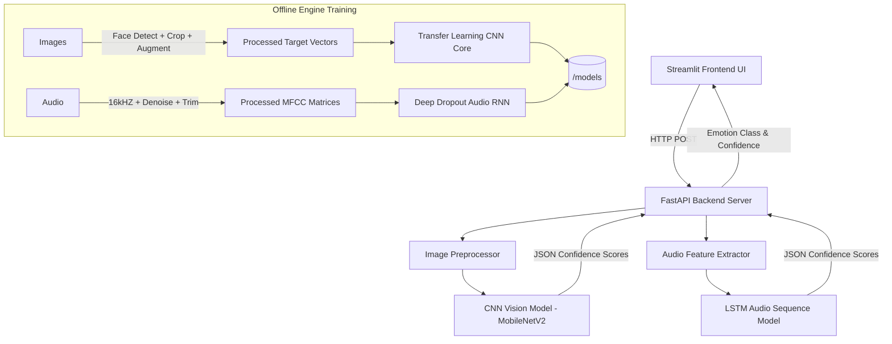

<<<<<<< HEAD
# MeowMood: AI-Based Cat Emotion Recognition System

  

## 🎯 Project Overview & Problem Statement

Cat owners often misinterpret their pet's emotions because feline body language and vocalizations are highly subtle and complex. 
This project aims to bridge the communication gap by deploying a comprehensive **AI System** that actively analyzes **cat facial expressions** (images) and **vocalizations** (meows - audio) to accurately detect four distinct emotions:

- Happy 😺
- Sad 😿
- Angry 😾
- Fearful 😨

The final system features a decoupled, modular architecture encompassing an interactive **Streamlit Dashboard ("MeowMood")** supported seamlessly by a rigorous **FastAPI** inference loop processing highly trained **CNN** (ResNet/MobileNetV2 based) and **LSTM** models internally.

---

## 🏗️ System Architecture

The project is strictly segregated establishing robust Data, Backend logic, Frontend formatting, and Evaluation output workflows preventing module collision.



### Folder Structure
```text
project_root/
│
├── backend/
│   ├── train/                  # Active training engines
│   │   ├── image_model.py      # MobileNetV2 CNN Compiler 
│   │   └── audio_model.py      # LSTM sequential Network
│   ├── app.py                  # FastAPI server infrastructure
│   └── utils.py                # OpenCV / Librosa Payload processors
│
├── frontend/
│   └── app.py                  # Streamlit Interactive Dashboard
│
├── data/
│   ├── raw/                    # Central Dataset Aggregation folders
│   └── processed/              # Extracted payloads / FastAPI Blobs
│
├── outputs/                    # Exported Training Analytics
│   ├── logs/                   # Dynamic TensorBoard Instances
│   └── results/                # Scikit-Learn txt reports + PNG Matrices
│
├── models/                     # Active Inference weights (*.h5)
├── scripts/                    # Fully Modular Automation Pipelines
│   ├── preprocess_audio.py
│   ├── preprocess_image.py
│   └── eda.py                  # Exploratory Data Analytics script
│
└── requirements.txt            # Static module versions
```

---

## 🚀 Installation & Setup

1. **Clone the Repository and Establish Environment:**
   Ensure you have a valid Python 3.9+ local instance installed and activated.
   ```bash
   # Install mandatory framework dependencies uniformly
   pip install -r requirements.txt
   ```

2. **Establish Data Targets (If working offline):**
   Ensure `data/raw/images` and `data/raw/audio` are populated with explicitly named class sub-folders: `['angry', 'fear', 'happy', 'sad']`.

---

## 🧠 How To Train the Models

Both the Vision and Audio architectures natively hook into automated processing metrics supporting **Accuracy mapped Early Stopping**, dynamic **Learning Rate Schedulers** (CNN), structured **Classification Output reporting**, and comprehensive graphical **Confusion Matrices**.

1. **Preprocess the Dataset (Optional depending on data integrity):**
   ```bash
   python scripts/preprocess_images.py
   python scripts/preprocess_audio.py
   python scripts/eda.py  # Generate Class Distribution audits
   ```

2. **Start Network Training Sequences:**
   Note: Both scripts assume fully compiled arrays natively pointing cleanly via absolute mapping constraints avoiding routing anomalies.
   ```bash
   # Train the CNN mapping explicitly to /models/image_model.h5
   python backend/train/image_model.py
   
   # Train the Audio LSTM targeting explicitly to /models/audio_model.h5
   python backend/train/audio_model.py
   ```

3. **Monitor the Training Hooks with TensorBoard:**
   Logs export securely tagged with Datetime signatures allowing exact mapping comparison tests.
   ```bash
   tensorboard --logdir=outputs/logs/
   ```

---

## ⚡ How to Run the Backend Inference Server

The Inference loop is completely decoupled from the UI interface processing multipart logic flawlessly.
   ```bash
   # Target Server bounds utilizing purely uvicorn loop hooks
   cd backend
   uvicorn app:app --host 0.0.0.0 --port 8000 --reload
   ```

---

## 🎨 How to Run the Frontend Dashboard

Navigate your user into a cleanly aesthetic (Yellow/Dark Theme) dashboard utilizing Streamlit allowing active Audio/Vision payload parsing mapping confidence variables statically against Pandas charts.
   ```bash
   # Hook interface mapping seamlessly matching port :8000 automatically
   cd frontend
   streamlit run app.py
   ```
=======
# Cat Emotion Recognition System 🐱

AI-based system for detecting cat emotions using facial (image) and vocal (audio) analysis.

## 🌟 Features

### Machine Learning Models
- **Image Classification**: ResNet50 (PyTorch) - 94MB trained model
- **Audio Classification**: Random Forest (Scikit-learn) - Optimized for CPU
- **Emotion Classes**: Angry, Defense, Fighting, Happy, Mother Call, Resting

### Web Application
- **User Authentication**: Gmail-only registration with secure password hashing
- **File Upload**: Support for images (JPG, PNG, GIF) and audio (MP3, WAV)
- **Real-time Prediction**: Instant emotion detection
- **History Tracking**: Complete prediction history per user
- **Modern UI**: Bootstrap-based responsive design with cute cat animations

## 📁 Project Structure

```
├── app.py                              # Main Flask application
├── requirements_web.txt                # Web app dependencies
├── backend/
│   ├── models_training/
│   │   ├── audio_model.py             # Audio model training script
│   │   ├── image_model.py             # Image model training script
│   │   └── requirements.txt           # Training dependencies
│   ├── trained_modelimages/
│   │   ├── audio_model/               # Trained audio classifier
│   │   └── image_model/               # Trained image classifier
│   └── inference/
│       ├── model_loader.py            # Singleton model loader
│       └── predictor.py               # Prediction functions
├── database/
│   ├── database_logic.py              # SQLAlchemy models
│   └── cat_emotion.db                 # SQLite database (auto-created)
├── front_end/
│   ├── templates/                     # Jinja2 HTML templates
│   ├── static/                        # CSS & JavaScript
│   └── front_end_png/                 # Cat images & GIFs
└── data_analysis/
    ├── test_traindeddata/
    │   ├── image_data/                # Training & test images
    │   └── audio_data/                # Training & test audio
    └── cleaned_data/                  # Data analysis scripts
```

## 🚀 Installation

### Prerequisites
- Python 3.12+
- 12GB RAM recommended
- Windows OS

### Step 1: Clone Repository
```bash
cd path/to/project
```

### Step 2: Create Virtual Environment
```bash
python -m venv .venv
.venv\Scripts\activate
```

### Step 3: Install Dependencies

**For Web Application:**
```bash
pip install Flask-Bcrypt Flask-SQLAlchemy email_validator python-dotenv
pip install Flask Flask-Login Pillow librosa torch torchvision numpy pandas scikit-learn joblib
```

**For Model Training (if needed):**
```bash
pip install -r backend/models_training/requirements.txt
```

## 🎯 Usage

### Running the Web Application

1. **Start the Flask server:**
```bash
python app.py
```

2. **Access the application:**
Open your browser and navigate to: `http://127.0.0.1:5000`

3. **Register & Login:**
   - Create an account (Gmail addresses only)
   - Login with your credentials

4. **Upload & Analyze:**
   - Select file type (Image or Audio)
   - Upload a cat image or audio file
   - View the emotion prediction result

5. **View History:**
   - Navigate to History page to see all past predictions

### Training Models (Optional)

The models are already trained, but you can retrain them:

**Train Audio Model:**
```bash
python backend/models_training/audio_model.py
```
- **Input**: `data_analysis/test_traindeddata/audio_data/train_data`
- **Output**: `backend/trained_modelimages/audio_model/`
- **Duration**: ~2-5 minutes

**Train Image Model:**
```bash
python backend/models_training/image_model.py
```
- **Input**: `data_analysis/test_traindeddata/image_data/imagetraindata`
- **Output**: `backend/trained_modelimages/image_model/`
- **Duration**: ~10-20 minutes (CPU), ~2-5 minutes (GPU)
- **Configuration**: 
  - Batch size: 16
  - Epochs: 10
  - Validation split: 20%

## 🔧 Configuration

### Model Settings
Edit `backend/models_training/audio_model.py` or `image_model.py`:
- `BATCH_SIZE`: Adjust based on available RAM
- `NUM_EPOCHS`: More epochs = better accuracy (but slower)
- `LEARNING_RATE`: Fine-tune convergence

### Flask Settings
Edit `app.py`:
- `SECRET_KEY`: Change for production deployment
- `UPLOAD_FOLDER`: Customize upload directory
- `ALLOWED_EXTENSIONS`: Add/remove file types

## 📊 Model Performance

### Image Model (ResNet50)
- **Architecture**: Transfer learning from ImageNet
- **Classes**: 6 emotion categories
- **Performance**: See `backend/trained_modelimages/image_model/training_history.csv`

### Audio Model (Random Forest)
- **Features**: MFCC, Chroma, Mel Spectrogram, Spectral Contrast, Tonnetz
- **Performance**: See `backend/trained_modelimages/audio_model/classification_report.txt`

## 🛡️ Security Features

- **Password Hashing**: bcrypt with salt
- **SQL Injection Protection**: SQLAlchemy ORM
- **Session Management**: Flask-Login
- **File Upload Security**: `secure_filename()` sanitization
- **Email Validation**: Gmail-only registration

## 🐛 Troubleshooting

### Models Not Loading
```
Warning: Image model not found
Warning: Audio model not found
```
**Solution**: Train the models first (see Training Models section)

### Import Errors
```
ModuleNotFoundError: No module named 'flask_bcrypt'
```
**Solution**: 
```bash
pip install Flask-Bcrypt Flask-SQLAlchemy
```

### Database Errors
**Solution**: Delete `database/cat_emotion.db` and restart the app (auto-creates fresh DB)

## 📝 API Reference

### Routes

| Route | Method | Description | Auth Required |
|-------|--------|-------------|---------------|
| `/` | GET | Redirect to login/dashboard | No |
| `/register` | GET, POST | User registration | No |
| `/login` | GET, POST | User login | No |
| `/logout` | GET | User logout | Yes |
| `/dashboard` | GET, POST | Upload & predict | Yes |
| `/history` | GET | View prediction history | Yes |
| `/assets/<filename>` | GET | Serve frontend assets | No |

## 🎨 Frontend Assets

The `/front_end/front_end_png/` directory contains cute cat GIFs and images used in the UI:
- `white-cute-cat-hearts.gif` - Login page
- `dance-dancing.gif` - Registration page
- `cute-animated-cat-tutorial.gif` - Dashboard result display

## 📜 License

This project is part of the Springboard Internship 2025 program.

## 👥 Contributors

- **Developer**: [Your Name]
- **Organization**: Springboard Internship 2025
- **Project**: Dev-of-an-AI-Based-Cat-Emotion-Recognition-System-Using-Facial-and-Vocal-Analysis

## 🔮 Future Enhancements

- [ ] Support for video analysis
- [ ] Real-time webcam emotion detection
- [ ] Mobile app integration
- [ ] Multi-language support
- [ ] Cloud deployment (AWS/Azure)
- [ ] RESTful API for third-party integration

## 📞 Support

For issues or questions, please refer to the project documentation or contact the development team.

---

**Built with ❤️ for cat lovers and AI enthusiasts**
>>>>>>> 6b31393ff2aec9e717b9fbf0b1a3ce23c58c566b
