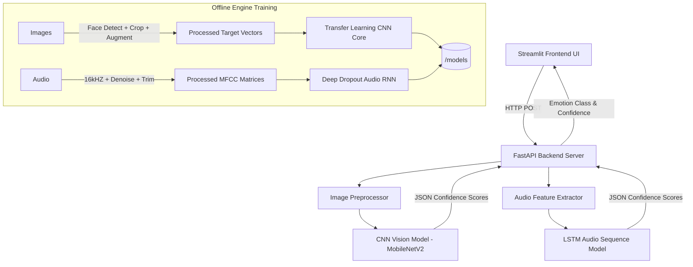

# MeowMood: AI-Based Cat Emotion Recognition System

  

## 🎯 Project Overview & Problem Statement

Cat owners often misinterpret their pet's emotions because feline body language and vocalizations are highly subtle and complex. 
This project aims to bridge the communication gap by deploying a comprehensive **AI System** that actively analyzes **cat facial expressions** (images) and **vocalizations** (meows - audio) to accurately detect four distinct emotions:

- Happy 😺
- Sad 😿
- Angry 😾
- Fearful 😨

The final system features a decoupled, modular architecture encompassing an interactive **Streamlit Dashboard ("MeowMood")** supported seamlessly by a rigorous **FastAPI** inference loop processing highly trained **CNN** (ResNet/MobileNetV2 based) and **LSTM** models internally.

---

## 🏗️ System Architecture

The project is strictly segregated establishing robust Data, Backend logic, Frontend formatting, and Evaluation output workflows preventing module collision.



### Folder Structure
```text
project_root/
│
├── backend/
│   ├── train/                  # Active training engines
│   │   ├── image_model.py      # MobileNetV2 CNN Compiler 
│   │   └── audio_model.py      # LSTM sequential Network
│   ├── app.py                  # FastAPI server infrastructure
│   └── utils.py                # OpenCV / Librosa Payload processors
│
├── frontend/
│   └── app.py                  # Streamlit Interactive Dashboard
│
├── data/
│   ├── raw/                    # Central Dataset Aggregation folders
│   └── processed/              # Extracted payloads / FastAPI Blobs
│
├── outputs/                    # Exported Training Analytics
│   ├── logs/                   # Dynamic TensorBoard Instances
│   └── results/                # Scikit-Learn txt reports + PNG Matrices
│
├── models/                     # Active Inference weights (*.h5)
├── scripts/                    # Fully Modular Automation Pipelines
│   ├── preprocess_audio.py
│   ├── preprocess_image.py
│   └── eda.py                  # Exploratory Data Analytics script
│
└── requirements.txt            # Static module versions
```

---

## 🚀 Installation & Setup

1. **Clone the Repository and Establish Environment:**
   Ensure you have a valid Python 3.9+ local instance installed and activated.
   ```bash
   # Install mandatory framework dependencies uniformly
   pip install -r requirements.txt
   ```

2. **Establish Data Targets (If working offline):**
   Ensure `data/raw/images` and `data/raw/audio` are populated with explicitly named class sub-folders: `['angry', 'fear', 'happy', 'sad']`.

---

## 🧠 How To Train the Models

Both the Vision and Audio architectures natively hook into automated processing metrics supporting **Accuracy mapped Early Stopping**, dynamic **Learning Rate Schedulers** (CNN), structured **Classification Output reporting**, and comprehensive graphical **Confusion Matrices**.

1. **Preprocess the Dataset (Optional depending on data integrity):**
   ```bash
   python scripts/preprocess_images.py
   python scripts/preprocess_audio.py
   python scripts/eda.py  # Generate Class Distribution audits
   ```

2. **Start Network Training Sequences:**
   Note: Both scripts assume fully compiled arrays natively pointing cleanly via absolute mapping constraints avoiding routing anomalies.
   ```bash
   # Train the CNN mapping explicitly to /models/image_model.h5
   python backend/train/image_model.py
   
   # Train the Audio LSTM targeting explicitly to /models/audio_model.h5
   python backend/train/audio_model.py
   ```

3. **Monitor the Training Hooks with TensorBoard:**
   Logs export securely tagged with Datetime signatures allowing exact mapping comparison tests.
   ```bash
   tensorboard --logdir=outputs/logs/
   ```

---

## ⚡ How to Run the Backend Inference Server

The Inference loop is completely decoupled from the UI interface processing multipart logic flawlessly.
   ```bash
   # Target Server bounds utilizing purely uvicorn loop hooks
   cd backend
   uvicorn app:app --host 0.0.0.0 --port 8000 --reload
   ```

---

## 🎨 How to Run the Frontend Dashboard

Navigate your user into a cleanly aesthetic (Yellow/Dark Theme) dashboard utilizing Streamlit allowing active Audio/Vision payload parsing mapping confidence variables statically against Pandas charts.
   ```bash
   # Hook interface mapping seamlessly matching port :8000 automatically
   cd frontend
   streamlit run app.py
   ```
